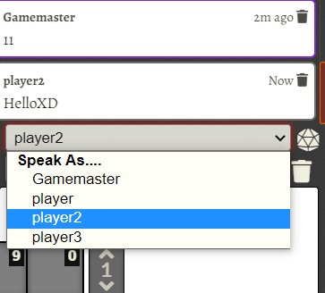

# speak As……

Specify the identity of the speaker, no longer based on the selected token

## Behavior

- A select bar for identity speaker
  - Will be on top if there is a 《Selected Character》
- A checkbox to contral 《Speak As》
  - Unchecked checkbox will Use the original FVTT Spearker setting.(Seleted token takes precedence over selected character)

## Current Problem

- Now 《Speak As》 is placed in the div tag chat-controls, which causes the display to change and distorted.
- Ideally, it is placed on the sidebar-tabs layer, between chatlog and chat-controls, but I don’t know how to write (CRY

## Changelog

### v1.5.1

fix >-u.character?.name
### v1.5.0

Show online actor first and remove dup

### v1.4.0

fix #12 ID problem. @IrishWolf

### v1.3.1

Remove V10 warnings, thankyou for @farling42

### v1.3.0

fit fot fvtt v10

### v1.2.1

fix bug. Thankyou ravingdragoon report.

### v1.2.0

Storage the checkbox state.

### v1.1.5

Get the style by js.

### v1.1.0

Add a checkbox for switch function.

First character be selected character.

### v1.0.0

Done.
